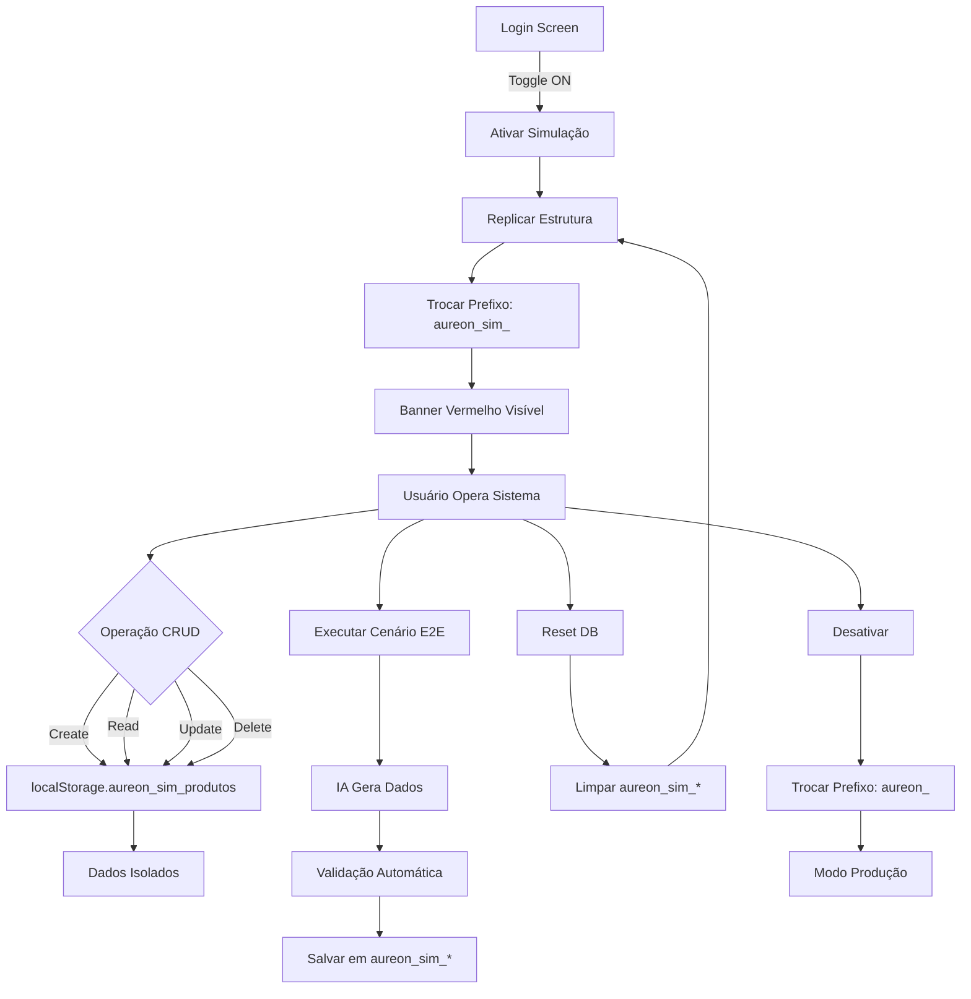

# 🎭 MODO DE SIMULAÇÃO GLOBAL (SANDBOX MODE)

## 📋 Visão Geral

O **Modo de Simulação** é um ambiente isolado e seguro para executar testes End-to-End (E2E) sem comprometer os dados reais de produção. Ele utiliza IA generativa para criar dados sintéticos realistas e valida o fluxo completo do sistema.

---

## 🏗️ Arquitetura de Isolamento de Dados

### Database Switching (Troca de Contexto)

O sistema implementa um padrão de troca dinâmica de banco de dados baseado no estado de simulação:

```javascript
// PRODUÇÃO
localStorage: aureon_produtos, aureon_vendas, aureon_clientes...

// SIMULAÇÃO (Modo Ativo)
localStorage: aureon_sim_produtos, aureon_sim_vendas, aureon_sim_clientes...
```

### Replicação de Estrutura

Ao ativar o Modo Simulação:
1. **Schema Replication**: A estrutura (tabelas vazias) do banco real é copiada para o banco simulado
2. **Data Isolation**: Nenhum dado de produção é copiado, apenas a estrutura
3. **Business Rules**: Todas as regras de negócio (cálculos, validações) funcionam identicamente

### Garantias de Segurança

✅ **Zero Impacto em Produção**: Dados simulados nunca tocam o banco real  
✅ **Isolamento Total**: Prefixos diferentes (`aureon_` vs `aureon_sim_`)  
✅ **Persistência de Sessão**: Estado salvo em `sessionStorage`  
✅ **Reset On-Demand**: Banco simulado pode ser resetado sem afetar produção

---

## 🎨 Interface do Usuário

### 1. Toggle de Simulação (Tela de Login)

**Localização**: Login Screen  
**Componente**: `Login.jsx`

**Comportamento**:
- Switch visual para ativar/desativar
- Exibe status atual (Ativo/Desativado)
- Persiste durante toda a sessão

**Visual**:
```
┌─────────────────────────────────────┐
│ 🎭 Modo Simulação (Sandbox)         │
│ ━━━━━━━━━━━━━━━━━━ ⚪️ OFF/🔴 ON    │
│ ❌ Desativado / 🎭 ATIVO            │
└─────────────────────────────────────┘
```

### 2. Barra de Alerta Visual (Global)

**Localização**: Topo de TODAS as telas  
**Componente**: `SimulationBanner.jsx`  
**Visibilidade**: Apenas quando Modo Simulação está ativo

**Features**:
- Cor vermelha chamativa (impossível ignorar)
- Fixed top (sempre visível)
- Botões de controle:
  - **Reset DB**: Limpa todos os dados simulados
  - **Export Data**: Exporta dados para JSON
  - **Desativar**: Volta ao banco de produção
- Estatísticas em tempo real: operações, timestamp

**Visual**:
```
┌─────────────────────────────────────────────────────────┐
│ ⚠️ 🎭 MODO SIMULAÇÃO ATIVO (SANDBOX)                    │
│ DB: aureon_sim_* | 42 operações | Reset | Export | X   │
└─────────────────────────────────────────────────────────┘
```

### 3. Simulation Control Panel (CEO Dashboard)

**Localização**: Dashboard Executivo (CEO)  
**Componente**: `SimulationControlPanel.jsx`  
**Visibilidade**: Apenas CEO + Modo Simulação ativo

**Features**:
- Estatísticas do banco simulado (produtos, vendas, etc.)
- Cenários de teste pré-configurados:
  - **E2E Completo**: Fluxo completo (Fornecedor → Produto → Venda)
  - **Bulk Load**: Carga massiva de dados sintéticos
- Botões de gerenciamento (Reset, Export)

---

## 🤖 IA Generativa (SimulationSeederService)

### Auto-Fill de Formulários

**Componente**: `SimulationAutoFillButton.jsx`  
**Comportamento**: Botão "✨ Auto-Fill AI" visível apenas em Modo Simulação

**Como Usar**:
1. Abra qualquer formulário (Produto, Fornecedor, Cliente)
2. Clique no botão "Auto-Fill AI"
3. Campos preenchidos automaticamente com dados realistas

**Dados Gerados**:
```javascript
// Produto
{
  tipo: 'Óculos de Sol',
  modelo: 'Aviator Classic',
  precoCusto: 45.80,
  precoImportacao: 12.50,
  precoVenda: 158.90,
  quantidadeComprada: 120,
  estoque: 95,
  fornecedorId: 'Alibaba Eyewear Co.'
}

// Validação Automática
✅ Todos os campos obrigatórios preenchidos
✅ CPF válido para clientes
✅ Preços coerentes (margem de lucro realista)
✅ IDs de fornecedores existentes no banco
```

### Cenários de Teste Pré-Configurados

#### 1. Cenário E2E Completo

**Objetivo**: Validar fluxo completo do sistema

**Passos Executados**:
1. **Criar Fornecedor**: Gera fornecedor sintético com lead time
2. **Adicionar Item ao Fornecedor**: Item com tipo, modelo, custos
3. **Criar Produto**: Produto baseado no item (validação Single Source of Truth)
4. **Criar Cliente**: Cliente com dados válidos
5. **Realizar Venda**: Venda do produto criado
6. **Verificar Baixa de Estoque**: Sistema automaticamente atualiza estoque

**Como Executar**:
1. Ativar Modo Simulação no Login
2. Entrar como CEO
3. No Dashboard, clicar em "Executar" no Cenário E2E
4. Aguardar confirmação de sucesso
5. Verificar dados criados nos módulos

**Resultado Esperado**:
- ✅ Fornecedor criado
- ✅ Produto criado com lucro calculado
- ✅ Cliente cadastrado
- ✅ Venda registrada
- ✅ Estoque atualizado (quantidade física diminuída)
- ✅ Audit Log registra todas as operações

#### 2. Cenário Bulk Load

**Objetivo**: Testar performance com grande volume de dados

**Comportamento**:
- Prompt pergunta: "Quantos registros deseja criar?"
- Cria múltiplos registros de cada tipo:
  - `N` fornecedores
  - `N * 3` produtos
  - `N * 2` clientes

**Como Executar**:
1. No Dashboard CEO (Modo Simulação)
2. Clicar em "Executar" no Cenário Bulk Load
3. Digitar quantidade (ex: 50)
4. Aguardar conclusão
5. Verificar estatísticas no Control Panel

**Resultado Esperado**:
- ✅ 50 fornecedores
- ✅ 150 produtos
- ✅ 100 clientes
- ✅ Todos com dados consistentes e válidos

---

## 🔧 Guia de Uso (Passo a Passo)

### Para QA/Testers

#### Teste Manual de Fluxo

1. **Ativar Simulação**:
   ```
   Login Screen → Toggle "Modo Simulação" → ON
   ```

2. **Login como CEO**:
   ```
   Username: admin
   Password: admin123
   ```

3. **Verificar Banner Vermelho**:
   ```
   Topo da tela: "🎭 MODO SIMULAÇÃO ATIVO"
   ```

4. **Executar Cenário E2E**:
   ```
   Dashboard CEO → Simulation Control Panel → "Executar" (E2E)
   ```

5. **Validar Resultados**:
   - Ir para "Produtos" → Verificar produto criado
   - Ir para "Vendas" → Verificar venda registrada
   - Ir para "Clientes" → Verificar cliente cadastrado

6. **Testar Auto-Fill**:
   ```
   Produtos → "Cadastrar Novo Item" → "✨ Auto-Fill AI"
   ```

7. **Resetar Banco**:
   ```
   Banner Vermelho → "Reset DB" → Confirmar
   ```

8. **Exportar Dados**:
   ```
   Banner Vermelho → "Export" → Salvar JSON
   ```

9. **Desativar Simulação**:
   ```
   Banner Vermelho → "Desativar" → Confirmar
   ```

### Para Desenvolvedores

#### Adicionar Auto-Fill em Novo Formulário

```jsx
import SimulationAutoFillButton from '../components/SimulationAutoFillButton';

function MeuFormulario() {
  const [formData, setFormData] = useState({ nome: '', email: '' });

  return (
    <form>
      {/* Campos do formulário */}
      
      {/* ✅ Botão Auto-Fill (visível apenas em simulação) */}
      <SimulationAutoFillButton
        formType="cliente" // ou 'produto', 'fornecedor', 'item_fornecedor'
        onFill={(data) => setFormData(data)}
      />
      
      <button type="submit">Salvar</button>
    </form>
  );
}
```

#### Criar Novo Cenário de Teste

```javascript
// src/services/SimulationSeederService.js

export const meuNovoC enario = (context) => {
  console.log('🎬 [MEU CENÁRIO] Iniciando...');
  
  const { addProduto, addVenda } = context;
  
  // 1. Criar dados
  const produto = generateProduto();
  addProduto(produto);
  
  // 2. Executar ações
  setTimeout(() => {
    const venda = generateVenda([produto]);
    addVenda(venda);
    console.log('✅ [MEU CENÁRIO] Concluído!');
  }, 500);
};
```

#### Usar Prefixo Dinâmico em Novo Context

```javascript
import { useSimulation } from './SimulationContext';

export const MeuContextProvider = ({ children }) => {
  const { getPrefix } = useSimulation();
  const dbPrefix = getPrefix(); // 'aureon_' ou 'aureon_sim_'
  
  const [dados, setDados] = useState(() => {
    const key = `${dbPrefix}meus_dados`;
    return JSON.parse(localStorage.getItem(key) || '[]');
  });
  
  useEffect(() => {
    localStorage.setItem(`${dbPrefix}meus_dados`, JSON.stringify(dados));
  }, [dados, dbPrefix]);
};
```

---

## 📊 Fluxo de Dados



---

## 🧪 Casos de Teste

### TC001: Ativação de Modo Simulação

**Pré-condição**: Usuário na tela de login  
**Passos**:
1. Clicar no toggle "Modo Simulação"
2. Verificar status: "🎭 ATIVO"
3. Fazer login

**Resultado Esperado**:
- ✅ Banner vermelho aparece no topo
- ✅ `sessionStorage.simulation_mode === 'true'`
- ✅ Dados salvos com prefixo `aureon_sim_`

### TC002: Execução de Cenário E2E

**Pré-condição**: Modo Simulação ativo + Login CEO  
**Passos**:
1. Ir para Dashboard
2. Clicar em "Executar" no Cenário E2E
3. Aguardar conclusão

**Resultado Esperado**:
- ✅ Alert de sucesso exibido
- ✅ 1 fornecedor criado
- ✅ 1 produto criado (com lucro calculado)
- ✅ 1 cliente criado
- ✅ 1 venda registrada
- ✅ Estoque do produto diminuiu

### TC003: Auto-Fill de Formulário

**Pré-condição**: Modo Simulação ativo  
**Passos**:
1. Ir para "Fornecedores"
2. Clicar em "Cadastrar Novo Item"
3. Clicar em "✨ Auto-Fill AI"
4. Verificar campos preenchidos
5. Salvar

**Resultado Esperado**:
- ✅ Todos os campos obrigatórios preenchidos
- ✅ Dados realistas (nomes, emails, preços)
- ✅ Validação passa sem erros
- ✅ Fornecedor salvo com sucesso

### TC004: Isolamento de Dados

**Pré-condição**: Banco de produção com 50 produtos  
**Passos**:
1. Ativar Modo Simulação
2. Ir para "Produtos"
3. Verificar lista vazia
4. Criar 10 produtos simulados
5. Desativar Modo Simulação
6. Verificar lista de produtos

**Resultado Esperado**:
- ✅ Lista vazia ao ativar simulação
- ✅ 10 produtos criados em `aureon_sim_produtos`
- ✅ Lista mostra 50 produtos originais ao desativar
- ✅ 10 produtos simulados não aparecem em produção

### TC005: Reset de Banco Simulado

**Pré-condição**: Modo Simulação ativo + Dados criados  
**Passos**:
1. Criar 20 produtos simulados
2. Clicar em "Reset DB" no banner
3. Confirmar
4. Ir para "Produtos"

**Resultado Esperado**:
- ✅ Alert de confirmação exibido
- ✅ `aureon_sim_produtos` vazio
- ✅ Lista de produtos vazia
- ✅ Estrutura mantida (tabela existe)

---

## 🚨 Troubleshooting

### Problema: Banner não aparece

**Causa**: Modo Simulação não ativado corretamente  
**Solução**:
```javascript
// Console do navegador
sessionStorage.setItem('simulation_mode', 'true');
window.location.reload();
```

### Problema: Dados aparecem em produção

**Causa**: Prefixo não foi trocado  
**Solução**:
1. Verificar `SimulationContext` está no topo do `main.jsx`
2. Verificar `DataContext` usa `getPrefix()` do `useSimulation()`
3. Limpar localStorage: `localStorage.clear()`

### Problema: Cenário E2E falha

**Causa**: Validação de produto falhando  
**Solução**:
1. Verificar `validateProduct()` em `productUtils.js`
2. Garantir que `generateProduto()` preenche TODOS os campos obrigatórios:
   - tipo
   - modelo
   - precoCusto
   - precoImportacao
   - quantidadeComprada
   - fornecedorId

### Problema: Auto-Fill não funciona

**Causa**: `SimulationAutoFillButton` não recebe `onFill` correto  
**Solução**:
```jsx
<SimulationAutoFillButton
  formType="produto"
  onFill={(data) => {
    // ✅ Espalhar dados no state
    setFormData(prevData => ({ ...prevData, ...data }));
  }}
/>
```

---

## 📈 Métricas e Monitoramento

### Estatísticas Disponíveis

O `SimulationContext` rastreia:
- **activated**: Boolean (se modo está ativo)
- **startTime**: ISO timestamp (quando foi ativado)
- **operationsCount**: Contador de operações CRUD
- **lastOperation**: Última operação executada

### Acessar Estatísticas

```javascript
const { simulationStats } = useSimulation();

console.log(simulationStats);
// {
//   activated: true,
//   startTime: "2025-12-04T14:30:00.000Z",
//   operationsCount: 127,
//   lastOperation: "SIMULATION_E2E_EXECUTED"
// }
```

---

## 🔐 Segurança e Melhores Práticas

### ✅ Garantias de Segurança

1. **Isolamento por Prefixo**: Impossível misturar dados
2. **Sessão Temporária**: `sessionStorage` limpa ao fechar navegador
3. **Visual Claro**: Banner vermelho impede esquecimento
4. **Reset Fácil**: Um clique para limpar tudo

### ⚠️ Avisos Importantes

1. **NÃO use em produção**: Modo Simulação é APENAS para testes
2. **Dados temporários**: Reset pode acontecer a qualquer momento
3. **Performance**: Bulk Load com 1000+ registros pode travar navegador
4. **Browser Storage**: localStorage tem limite de ~5MB por domínio

### 🎯 Boas Práticas

1. **Sempre desativar após testes**: Evita confusão
2. **Exportar dados importantes**: Antes de resetar
3. **Usar cenários prontos**: Mais rápido que criar manualmente
4. **Documentar novos cenários**: Para reuso futuro
5. **Validar Field-Level Security**: Testar com diferentes perfis (CEO, VENDAS, ESTOQUE)

---

## 📚 Referências de Código

### Arquivos Principais

- **SimulationContext.jsx**: Gerenciamento de estado e troca de DB
- **SimulationSeederService.js**: IA generativa e cenários
- **SimulationBanner.jsx**: Barra de alerta visual
- **SimulationAutoFillButton.jsx**: Botão de auto-fill
- **SimulationControlPanel.jsx**: Painel de controle CEO
- **DataContext.jsx**: Integração com prefixo dinâmico
- **Login.jsx**: Toggle de ativação

### Hooks Customizados

```javascript
const { 
  isSimulationMode,          // Boolean
  activateSimulation,        // Function
  deactivateSimulation,      // Function
  resetSimulationDatabase,   // Function
  getPrefix,                 // Function → 'aureon_' | 'aureon_sim_'
  getSimulationData,         // Function → { produtos: 10, vendas: 5, ... }
  exportSimulationData,      // Function
  simulationStats            // Object
} = useSimulation();
```

---

## 🎉 Conclusão

O **Modo de Simulação Global** permite:
- ✅ Testes E2E sem risco de corromper dados reais
- ✅ Validação completa de fluxos com IA generativa
- ✅ Carga de massa para testes de performance
- ✅ Auto-fill de formulários para agilizar testes manuais
- ✅ Isolamento total com garantia de segurança

**Status**: ✅ Implementação completa e operacional
